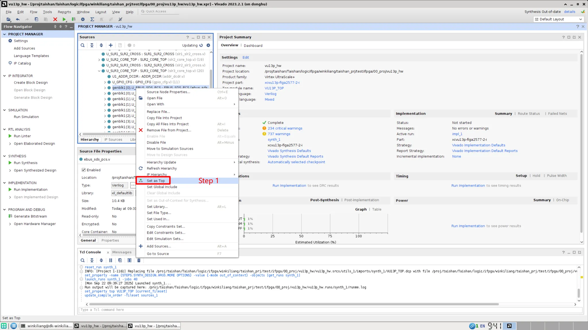

## 综合

### 生成dcp文件

1. 将需要生成dcp的文件设置为顶层（`set as top`）
    
2. 进入综合设置（`SYNTHESIS → Setting → More Options 输入 -mode out_of_context`）
    
    
    
3. 跑综合并打开（`SYNTHESIS → Run Synthesis → Open Synthesized Design` ）
    
    
    
4. 在命令行窗口输入
    
    1. `write_checkpoint -force /proj/winkiliang/dcp_file/ebus_sds_pcs.dcp`
        
        
        
    2. 在命令行窗口输入`write_verilog -mode/proj/winkiliang/dcp_file/ebus_sds_pcs_sim.v`
        
        
        
5. 得到生成的dcp文件或仿真文件
    
    
    
6. 给dcp文件添加wrapper
    
    
    
7. 把dcp文件以及wrapper提供给其他人
    

<aside> 💡

注：仅负责生成dcp的工程需要添加-mode out_of_context选项

</aside>

### 使用dcp文件

1. 选择添加目标dcp文件
    
    
    

<aside> 💡

注：dcp文件不能传输参数

</aside>

## 参考文献：

[详解vivado网表文件DCP文件的封装生成、使用与注意事项](https://blog.csdn.net/u014586651/article/details/110653530)